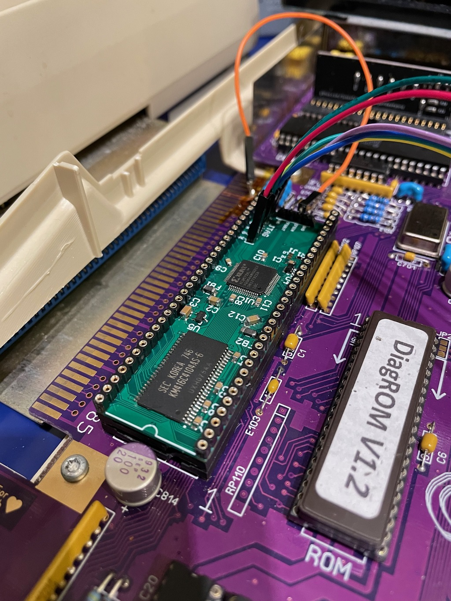
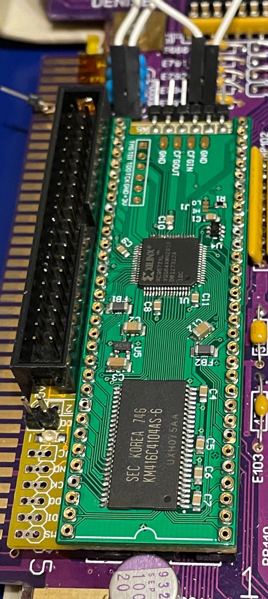

# GottaGoFastRAM 8MB Autoconfig Fast RAM

## !! EXPERIMENTAL FIRMWARE !!
This branch includes an experimental firmware that allows this board to coexist with other Autoconfig devices without needing any cfgin/out connection

This requires Kickstart 2 or higher

This is an 8MB Autoconfig Fast RAM for Amiga 500/1000/2000/CDTV based on mkl's mem68k  
It's small size allows it to be stacked on top of an ide68k board  
Rather than use the original mem68k Abel code I have written a new memory controller in Verilog

## Table of contents
1. [PCB Ordering](#ordering-pcbs)
2. [Mounting Options](#mounting-options)
3. [Cfgin/out](#cfginout)
4. [Jumpers](#jumpers)
5. [CDTV](#cdtv)
6. [Timing Diagrams](#timing-diagrams)
7. [Bill of materials](#bill-of-materials)
8. [Known Issues](#known-issues)
9. [Experimental firmware](#experimental-firmware)

## Ordering PCBs
I recommend ordering the PCB with a 0.6 or 0.8mm thickness if you intend on stacking with an ide68k or mouting using a DIP socket/machined pin strips.  
If you are going to mount using the socket pins and not stacking with an ide68k I'd recommend going with the usual 1.6mm to reduce flexing.

## Mounting options

1. Can be soldered to the bottom of a machined pin socket/machined pin strips (will require some cutting of the dip socket to fit the caps/ferrites near the plastic)  
  
2. Can be soldered to socket pins and stacked with an ide68k  
  
  

## Cfgin/out
These pins allow you to insert the memory module into your autoconfig chain.  
If there are no other autoconfig devices in your system you can just leave these unconnected otherwise you will need to either connect CFGOut to the CFGin of the first device in your existing autoconfig chain, or connect CFGIn to the CFGOut pin of the last device in your existing autoconfig chain.  
In the Amiga 2000 you can connect CFGIN to U606 Pin 8 which will add the device to the end of the chain but __NOTE: This takes up the config signal for the leftmost slot (CN601) so do NOT install a Zorro card there__

You can also connect cfgin and cfgout with a jumper to disable the device temporarily

## Jumpers
J1: Cfgin pull up/down (You will probably want to leave this at default unless you know what you're doing)  
J2-3: Bridge these if you have not fitted the buffer U4

## CDTV
The CDTV's DMAC takes up the first autoconfig slot, so if you intend to use this with a CDTV use the CDTV specific .JED file to program the CPLD

If you have a Rev A or Rev B (not B1) board you will need to apply a [small mod for CDTV compatibility](https://github.com/LIV2/GottaGoFastRAM/issues/4/#issuecomment-868977723)

## Timing Diagrams
  

### Bill of materials
|Component|Location|QTY|Link|Remarks|
|---------|--------|---|------|--------|
|4Mx16 3V DRAM TSSOP - K4E641612D or GM71VS65163 |U3|1|-|eBay/Aliexpress etc.|
|XC9572XL-10VQ64C|U1|1|[Mouser](https://www.mouser.se/ProductDetail/217-C9572XL-10VQG64C) [DigiKey](https://www.digikey.com/short/2f7qn38b)||
|74LVC2G17 TSSOP-6/SOT-363|U4|1|[Mouser](https://www.mouser.com/ProductDetail/771-74LVC2G17GVQ100H) [DigiKey](https://www.digikey.com/short/95mn57tt) ||
|AP2210N-3.3 SOT-23|U5|1|[Mouser](https://www.mouser.com/ProductDetail/621-AP2210N-3.3TRG1) [DigiKey](https://www.digikey.com/short/30rd0zn5)|Maybe can be substituted with MCP1703AT-3302E|
|74LVC245N TSSOP|U6,U7|2|[Mouser](https://www.mouser.com/ProductDetail/595-SN74LVC245APWRG4) [DigiKey](https://www.digikey.com/short/pnq3wff3)|Can be substituted with SN74LVTH245 or SN74LVCR2245|
|Ferrite Bead, 1206 package|FB1, FB2|2|[Mouser](https://www.mouser.com/ProductDetail/875-MI1206K601R-10) [DigiKey](https://www.digikey.com/short/n4p04ctv)|Can be substituted with 0 Ohm 1206 resistors|
|10K Resistor, 0603|R1|1|[Mouser](https://www.mouser.com/ProductDetail/603-RT0603FRD0710KL) [DigiKey](https://www.digikey.com/short/nvvrt5dw)||
|0.1uF Ceramic Capacitor, 0603|C1,4-13|11|[Mouser](https://www.mouser.com/ProductDetail/80-C603C104K5RAC3121) [DigiKey](https://www.digikey.com/short/f7trtfwt)||
|4.7uF Ceramic Capacitor, 1206|C2|1|[Mouser](https://www.mouser.com/ProductDetail/187-CL31B475KAHNFNE) [DigiKey](https://www.digikey.com/short/d7mbf5nn)||
|10uF Ceramic Capacitor, 1206|C3|1|[Mouser](https://www.mouser.com/ProductDetail/187-CL31A106MAHNNNE) [DigiKey](https://www.digikey.com/short/rqt1br0q)||
|Socket pins|Pins|64|[Aliexpress](https://www.aliexpress.com/item/32791545218.html?spm=a2g0o.productlist.0.0.6e223b55CVrXSq&algo_pvid=8fda9f5a-6e07-4dc8-9ed4-bd809bf75756&algo_expid=8fda9f5a-6e07-4dc8-9ed4-bd809bf75756-0&btsid=2100bde316043149660504011ef819&ws_ab_test=searchweb0_0,searchweb201602_,searchweb201603_)|Use these if stacking with an ide68k module|
|64-Pin DIP socket - machined pin|Pins|1|[Mouser](https://www.mouser.com/ProductDetail/575-193964)|If not stacking with ide68k - pcb can be soldered to bottom of this flush with the plastic|

## Known issues
1. Rev A & B - Incorrect voltage supplied to U4 causes incompatibility with CDTV. Fixed in Rev B1 but you can [rework Rev A or B boards by following the instructions here](https://github.com/LIV2/GottaGoFastRAM/issues/4/#issuecomment-868977723)

## Experimental Firmware
* [AutoSnoop Firmware - Autoconfig after all other Z2 devices without any wires](https://github.com/LIV2/GottaGoFastRAM/tree/snoopy)
